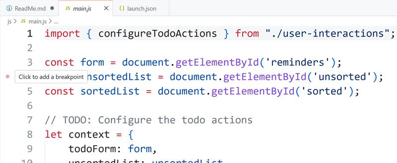
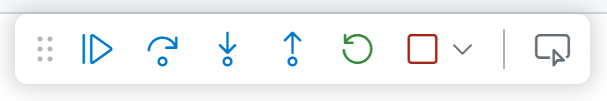

# Moving/Removing Elements with the DOM API

- [x] Removing items using the `.remove()`
- [x] Adding new items to unsorted using the `.appendChild()`
- [x] Moving an item from unsorted to sorted using the `.appendChild()`
- [x] Moving an item up or down in the list with `.insertBefore()`.
- [ ] ***Debugging** in VS Code*

----

## Debugging in VS Code

The "poor man's debugger" in the JavaScript world is to just do a bunch of `console.log()` statements in your code to see what's happening. That can work - up to a point. It won't take too long until you discover that usig the **debugging tools** is *far superior*.

When debugging VS Code, it's best if the web project (the one with the `package.json`) is at the *root* of the editor's active workspace. Since this Student Workbook has several *separate* web projects, we need to re-launch VS Code inside of the project we want to debug (like this one).

1. Open the terminal in the folder of your web project.
2. Run `code -r .` in the terminal. The `-r` flag means to "re-launch" VS Code, and the `.` is the current directory (the folder of the web project we're in).

#### How to Debug

##### One-Time Setup

We'll use the built-in JavaScript debugger for VS Code. There are several ways to get this started. The cleanest one I've found is to do the following.

1. First, launch the web server (`pnpm dev`).
1. Open the command palette (`F1` or `ctrl`+`shift`+`p`) and type `Debug: Open Link`.
1. For the url of our *Vite* development server, it defaults to using `http://localhost:5173` (or at the next available port).
1. VS Code should pop up a notification asking if you want to save the launch settings. Click "Yes". That will create a file called `.vscode/launch.json` in your web project folder.

    

1. Alternatively, you can manually create the `.vscode/launch.json` file yourself. Change to `"type": "chrome",` if you like Google's Chrome browser, or use `"type": "edge",` if you like Microsoft's Edge browser.

    ```json
    {
        "configurations": [
            {
                "type": "msedge",
                "name": "http://localhost:5173",
                "request": "launch",
                "url": "http://localhost:5173"
            }
        ]
    }
    ```

##### Debugging Tools

It's good to take some time and get familiar with the [debugger user interface](https://code.visualstudio.com/docs/debugtest/debugging#_debugger-user-interface) in VS Code.

With the debugger, we can set breakpoints, step through code, and examine variables to see what's happening as our code executes. We'll start by adding a breakpoint at line 4 of our `main.js`.



There are several function keys that become useful for debugging. These are keyboard shortcuts to the visual toolbar that appears when the debugger is launched.



- `F5` - Start a debugging session (if one isn't already launched) or Continue executing to the next breakpoint.
- `F10` - Step over (**execute**) the line of code you are currently paused on.
- `F11` - Step into a function call from the line you are paused on.
- `Shift` + `F11` - Step out of the function call you are paused in.

----

## Readings

- Learn about [Node Types](https://developer.mozilla.org/en-US/docs/Web/API/Node/nodeType)
- **[Element]() Members**
  - *Properties*
    - [`Element.tagName`](https://developer.mozilla.org/en-US/docs/Web/API/Element/tagName)
    - [`Element.classList`](https://developer.mozilla.org/en-US/docs/Web/API/Element/classList)
    - [`Element.children`](https://developer.mozilla.org/en-US/docs/Web/API/Element/children)
    - [`Element.childElementCount`](https://developer.mozilla.org/en-US/docs/Web/API/Element/childElementCount)
    - [`Element.firstElementChild`](https://developer.mozilla.org/en-US/docs/Web/API/Element/firstElementChild)
    - [`Element.lastElementChild`](https://developer.mozilla.org/en-US/docs/Web/API/Element/lastElementChild)
    - [`Element.nextElementSibling`](https://developer.mozilla.org/en-US/docs/Web/API/Element/nextElementSibling)
    - [`Element.previousElementSibling`](https://developer.mozilla.org/en-US/docs/Web/API/Element/previousElementSibling)
    - [`Element.`]()
  - *Methods*
    - [`Element.after()`](https://developer.mozilla.org/en-US/docs/Web/API/Element/after)
    - [`Element.before()`](https://developer.mozilla.org/en-US/docs/Web/API/Element/before)
    - [`Element.closest()`](https://developer.mozilla.org/en-US/docs/Web/API/Element/closest)
    - [`Element.append()`](https://developer.mozilla.org/en-US/docs/Web/API/Element/append)
    - [`Element.prepend()`](https://developer.mozilla.org/en-US/docs/Web/API/Element/prepend)
    - [`Element.remove()`](https://developer.mozilla.org/en-US/docs/Web/API/Element/remove)
    - [`Element.replaceWith()`](https://developer.mozilla.org/en-US/docs/Web/API/Element/replaceWith)
- **[Node](https://developer.mozilla.org/en-US/docs/Web/API/Node) Members**
  - *Properties*
    - [`Node.firstChild`](https://developer.mozilla.org/en-US/docs/Web/API/Node/firstChild)
    - [`Node.lastChild`](https://developer.mozilla.org/en-US/docs/Web/API/Node/lastChild)
    - [`Node.nextSibling`](https://developer.mozilla.org/en-US/docs/Web/API/Node/nextSibling)
    - [`Node.previousSibling`](https://developer.mozilla.org/en-US/docs/Web/API/Node/previousSibling)
    - [`Node.parentNode`](https://developer.mozilla.org/en-US/docs/Web/API/Node/parentNode)
    - [`Node.parentElement`](https://developer.mozilla.org/en-US/docs/Web/API/Node/parentNode)
  - *Methods*
    - [`Node.contains()`](https://developer.mozilla.org/en-US/docs/Web/API/Node/contains)
    - [`Node.appendChild()`](https://developer.mozilla.org/en-US/docs/Web/API/Node/appendChild)
    - [`Node.insertBefore()`](https://developer.mozilla.org/en-US/docs/Web/API/Node/insertBefore)
    - [`Node.removeChild()`](https://developer.mozilla.org/en-US/docs/Web/API/Node/removeChild)
    - [`Node.replaceChild()`](https://developer.mozilla.org/en-US/docs/Web/API/Node/replaceChild)
- [We can finally move elements in the browser with the moveBefore() API](https://dev.to/logrocket/we-can-finally-move-elements-in-the-browser-with-the-movebefore-api-37dc) - *Apr 30, 2025*


----

## `Element.append()` vs `Node.appendChild()`

### **1. What they do (in plain terms)**

| Method              | What it does                                       | Works on                                            | Returns                        |
| ------------------- | -------------------------------------------------- | --------------------------------------------------- | ------------------------------ |
| **`append()`**      | Inserts nodes **or text** at the end of an element | **Element**                                         | **Nothing** (`void`)           |
| **`appendChild()`** | Inserts **a single node** at the end of a node     | **Any Node** (Elements, Text nodes, Comments, etc.) | **The node that was appended** |

---

### **2. What they accept (important difference!)**

#### **`append()` accepts multiple arguments**

```js
element.append("Hello ", anotherNode, " world!");
```

#### **`appendChild()` accepts exactly one *Node***

```js
element.appendChild(anotherNode); // must be a Node
```

#### **Key point:**

✨ `append()` can insert **strings directly**, automatically creating Text nodes.
❌ `appendChild()` **cannot** accept strings.

---

### **3. Error handling**

#### `append()`

* **Never throws** for text.
* Throws only if the element cannot accept children (rare cases).

#### `appendChild()`

* **Throws an error** if:

  * You pass a string (not a Node)
  * You try to append a node that would create a cycle in the DOM

Example error:

```js
element.appendChild("hello"); // ❌ TypeError: parameter is not of type 'Node'
```

---

### **4. Parent types allowed**

| Method            | Can append to non‐Element nodes?                           |
| ----------------- | ---------------------------------------------------------- |
| **append()**      | ❌ No — only Elements                                       |
| **appendChild()** | ✔ Yes — any Node (Elements, Text, DocumentFragments, etc.) |

---

### **5. Return value differences**

Often overlooked but important for chaining:

#### `appendChild()`

```js
const returned = parent.appendChild(child); 
// returned === child
```

#### `append()`

```js
const returned = parent.append("hi");
// returned === undefined
```

---

### **6. Real-world examples**

#### **Using `append()`**

```js
const div = document.querySelector("div");
div.append("Hello ", document.createElement("span"), "!");
```

#### **Using `appendChild()`**

```js
const list = document.querySelector("ul");
const li = document.createElement("li");
li.textContent = "Item";
list.appendChild(li);
```

---

### **7. Practical recommendations**

#### ✔ **Use `append()` for most day-to-day DOM work**

* Accepts **strings or nodes**
* Can take **multiple arguments**
* Doesn't throw errors as easily
* Cleaner and more ergonomic

> Most modern code uses `append()` because it’s more convenient and flexible.

---

#### ✔ **Use `appendChild()` when you specifically need a Node returned**

For example, when building and chaining:

```js
const li = ul.appendChild(document.createElement("li"));
li.append("Done!");
```

Or when working heavily with:

* `DocumentFragment`
* custom DOM manipulation libraries
* low-level DOM code

---

#### ✔ **Use `appendChild()` when appending to non-Element nodes**

Examples:

* appending to a `DocumentFragment`
* appending to a `Text` node (rare)
* appending to `document`

---

#### ❌ Avoid `appendChild()` when inserting text

It forces you to create Text nodes manually:

```js
node.appendChild(document.createTextNode("Hello"));
```

Whereas `append("Hello")` is simpler.

---

### **8. Quick student-ready summary**

#### **`append()`**

* ✔ Accepts *strings or nodes*
* ✔ Accepts *multiple arguments*
* ✔ Safer: no TypeErrors for text
* ❌ Works only on Elements
* ❌ Returns nothing

#### **`appendChild()`**

* ✔ Accepts *only a single Node*
* ✔ Returns the appended Node
* ✔ Works on any Node (including DocumentFragment)
* ❌ Throws errors if argument isn't a Node
* ❌ Cannot append text directly

----

## About Moving Items in the DOM

If you want to **move an element in the DOM** using the modern **DOM API**, you can now use the new `Element.moveBefore()` method (available in modern browsers) or the traditional `appendChild()` / `insertBefore()` methods for compatibility.

### 1. Using the New `moveBefore()` API (Modern Browsers)

```html
<!DOCTYPE html>
<html>
<body>
  <ul id="list">
    <li id="item1">Item 1</li>
    <li id="item2">Item 2</li>
    <li id="item3">Item 3</li>
  </ul>

  <script>
    try {
      const list = document.getElementById("list");
      const item3 = document.getElementById("item3");
      const item1 = document.getElementById("item1");

      // Move item3 before item1
      list.moveBefore(item3, item1);

    } catch (err) {
      console.error("moveBefore() not supported in this browser:", err);
    }
  </script>
</body>
</html>
```

Notes:

- `parent.moveBefore(nodeToMove, referenceNode)` moves `nodeToMove` before `referenceNode` within the same parent.
- If `referenceNode` is `null`, it appends at the end.
- This preserves event listeners and state.


### 2. Using `insertBefore()` (Compatible with All Browsers)

```html
<!DOCTYPE html>
<html>
<body>
  <ul id="list">
    <li id="item1">Item 1</li>
    <li id="item2">Item 2</li>
    <li id="item3">Item 3</li>
  </ul>

  <script>
    const list = document.getElementById("list");
    const item3 = document.getElementById("item3");
    const item1 = document.getElementById("item1");

    // Move item3 before item1
    list.insertBefore(item3, item1);
  </script>
</body>
</html>
```

Notes:

- Works in **all browsers**.
- Moving an element with `insertBefore()` automatically removes it from its old position.


✅ Recommendation:

- Use `moveBefore()` if you target **modern browsers** and want cleaner semantics.
- Use `insertBefore()` for **maximum compatibility**.
